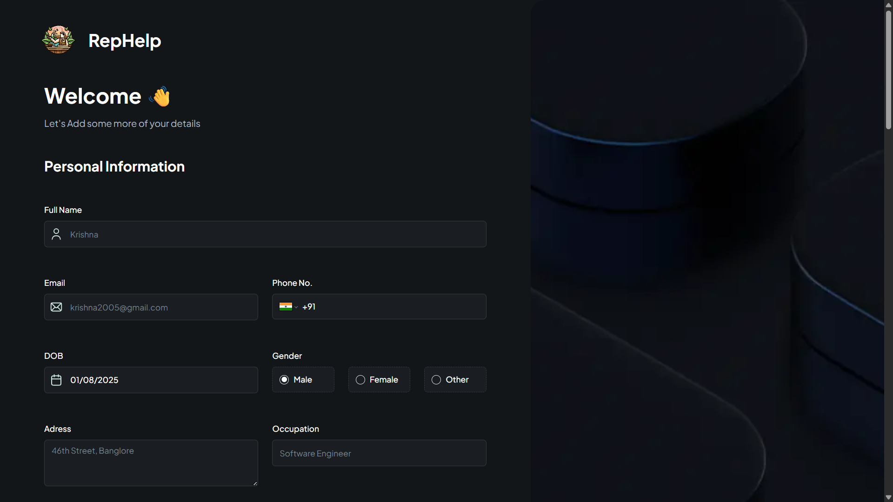
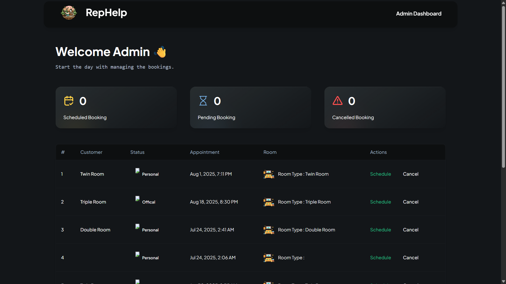
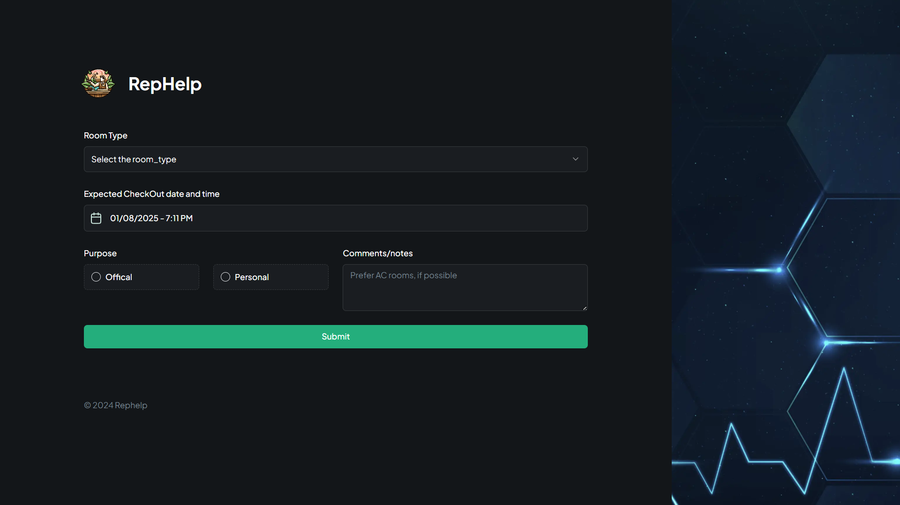
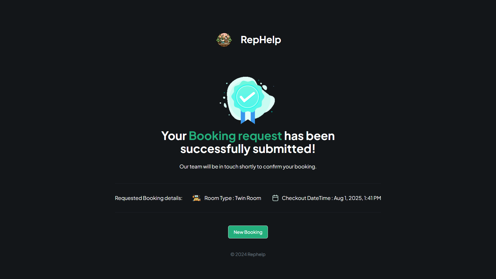

# RepHelp - Hotel Management System

<div align="center">
  
  <h1>RepHelp</h1>
</div>

<div align="center">

A modern, full-stack hotel management and room booking system built with Next.js, Neon PostgreSQL, Prisma, and TypeScript.

</div>

---

## 📖 About The Project

RepHelp is a comprehensive solution designed to streamline hotel reception management and room booking. It offers an intuitive interface for customers to register and book rooms, complete with OTP verification, file uploads, and a secure admin dashboard for managing bookings efficiently. The project leverages modern web technologies to provide a seamless, secure, and responsive experience.

---

### ✨ Key Features

#### 🔐 **Security & Authentication**
*   **OTP Verification:** Email-based OTP verification with elegant 6-digit input UI for customer authentication
*   **Session-Based Admin Access:** Secure admin dashboard with passkey protection and session management
*   **File Upload Security:** Cloudinary integration for secure document and image storage

#### 📝 **Customer Experience**
*   **Multi-Step Registration:** User-friendly registration flow with form validation
*   **Smart Booking System:** Intelligent appointment scheduling with automatic status management
*   **Real-time Notifications:** Toast notifications for all user actions (success, error, loading states)
*   **Document Upload:** Secure upload for ID documents, customer photos, and digital signatures

#### 🎯 **Smart Appointment Management**
*   **Time-Based Status Logic:** Appointments automatically marked as "scheduled" or "pending" based on check-in date
*   **Rescheduling:** Complete rescheduling functionality with pre-filled data and smart status updates
*   **Cancellation Workflow:** Soft-delete system with cancellation reasons (appointments marked, not deleted)
*   **Visual Indicators:** Strikethrough styling for cancelled appointments in admin view

#### 👨‍💼 **Admin Dashboard**
*   **Comprehensive Overview:** Track scheduled, pending, and cancelled bookings with stat cards
*   **Interactive Data Table:** Manage all bookings with inline actions (reschedule/cancel)
*   **Secure Access:** Session-based authentication with automatic timeout on browser close
*   **Logout Functionality:** Clean session management with logout button

#### 💅 **Modern UI/UX**
*   **Loading States:** Proper spinners and loading indicators throughout the application
*   **Toast Notifications:** Real-time feedback using Sonner for all operations
*   **Responsive Design:** Fully responsive UI built with Tailwind CSS and Shadcn/ui
*   **Form Validation:** Comprehensive validation using Zod and React Hook Form

---

## 🚀 Live Demo & Screenshots
  [**View Live Demo**](https://rephelp.netlify.app) 
-

### Live Demo
*The complete booking flow of RepHelp.*


### 🏠 Home & OTP Verification

*Customer registration with OTP verification flow.*


<br/>

### 📝 Registration Page

*Complete customer registration with file uploads.*


<br/>

### 🔒 Admin Dashboard

*Secure admin portal with comprehensive booking management.*


<br/>

### 📅 Appointment Booking

*Simple and intuitive room booking interface.*


<br/>


<br/>

---

## 🛠️ Tech Stack

This project is built with a modern and robust technology stack:

| Category              | Technology                                                                                             |
| --------------------- | ------------------------------------------------------------------------------------------------------ |
| **Frontend**          | [**Next.js 14**](https://nextjs.org/), [**React 18**](https://react.dev/), [**TypeScript**](https://www.typescriptlang.org/) |
| **Backend & Database**| [**Neon PostgreSQL**](https://neon.tech/) (Serverless), [**Prisma ORM**](https://www.prisma.io/)      |
| **File Storage**      | [**Cloudinary**](https://cloudinary.com/) (CDN & Image Optimization)                                  |
| **Styling**           | [**Tailwind CSS**](https://tailwindcss.com/), [**Shadcn/ui**](https://ui.shadcn.com/)                |
| **Form Management**   | [**React Hook Form**](https://react-hook-form.com/), [**Zod**](https://zod.dev/)                     |
| **Notifications**     | [**Sonner**](https://sonner.emilkowal.ski/) (Toast Notifications)                                    |
| **Email Service**     | [**Nodemailer**](https://nodemailer.com/) (Gmail SMTP for OTP)                                        |
| **Deployment**        | [**Vercel**](https://vercel.com/) / [**Netlify**](https://www.netlify.com/)                          |

---

## ⚙️ Getting Started

To get a local copy up and running, follow these simple steps.

### Prerequisites

Make sure you have the following installed on your machine:
*   [Node.js](https://nodejs.org/en/) (v20.x or higher)
*   [npm](https://www.npmjs.com/) (v10.x or higher) or [yarn](https://yarnpkg.com/)

### Installation & Setup

1.  **Clone the repository:**
    ```sh
    git clone https://github.com/mayank-1007/rephelp.git
    cd rephelp
    ```

2.  **Install dependencies:**
    ```sh
    npm install
    ```

3.  **Set up environment variables:**
    Create a `.env.local` file in the root of your project and add the following environment variables:

    ```env
    # Neon PostgreSQL Database
    DATABASE_URL="postgresql://[user]:[password]@[host]/[database]?sslmode=require"

    # Cloudinary Configuration (for file uploads)
    NEXT_PUBLIC_CLOUDINARY_CLOUD_NAME=your_cloud_name
    CLOUDINARY_CLOUD_NAME=your_cloud_name
    CLOUDINARY_API_KEY=your_api_key
    CLOUDINARY_API_SECRET=your_api_secret

    # Email Configuration (Nodemailer with Gmail)
    EMAIL_USER=your_email@gmail.com
    EMAIL_PASS=your_gmail_app_password

    # Admin Access (6-digit passkey)
    NEXT_PUBLIC_ADMIN_PASSKEY=111111
    ```

    **How to get credentials:**
    - **Neon Database:** Sign up at [neon.tech](https://neon.tech), create a project, and copy the connection string
    - **Cloudinary:** Sign up at [cloudinary.com](https://cloudinary.com), get your cloud name, API key, and secret from the dashboard
    - **Gmail App Password:** Enable 2FA on your Gmail account, then generate an app-specific password from [Google Account Settings](https://myaccount.google.com/apppasswords)

4.  **Set up the database:**
    ```sh
    npx prisma db push
    npx prisma generate
    ```

5.  **Run the development server:**
    ```sh
    npm run dev
    ```

6.  **Open the application:**
    Open [http://localhost:3000](http://localhost:3000) in your browser to see the application.

---

## 🚀 Deployment

The application can be deployed using Vercel or Netlify.

### Deploy to Vercel (Recommended)

1. Push your code to GitHub
2. Import your repository on [Vercel](https://vercel.com)
3. Add all environment variables from `.env.local`
4. Deploy!

Deployment Link - https://rephelp.netlify.app

---

## 📂 Project Structure

The project follows a standard Next.js `app` directory structure with Prisma ORM:

```
/
├── app/                      # Main application routes and UI
│   ├── admin/                # Admin dashboard page
│   ├── customer/             # Customer-facing pages
│   │   └── [userId]/         # Dynamic routes for users
│   │       ├── register/     # Registration page
│   │       └── new-booking/  # Booking pages
│   ├── api/                  # API routes
│   │   ├── upload/           # Cloudinary file upload
│   │   ├── send-otp/         # OTP generation
│   │   └── verify-otp/       # OTP verification
│   ├── layout.tsx            # Root layout with Toaster
│   ├── loading.tsx           # Global loading component
│   └── page.tsx              # Home page with customer form
├── components/               # Reusable React components
│   ├── form/                 # Form components
│   │   ├── CustomerForm.tsx  # OTP login form
│   │   ├── RegisterForm.tsx  # Full registration
│   │   └── AppointmentForm.tsx # Booking form
│   ├── table/                # Data table components
│   │   ├── columns.tsx       # Table column definitions
│   │   └── DataTable.tsx     # Reusable table
│   ├── ui/                   # Shadcn UI components
│   ├── AppointmentModal.tsx  # Cancel/reschedule modal
│   ├── PasskeyModal.tsx      # Admin authentication
│   ├── LogoutButton.tsx      # Admin logout
│   └── StatCard.tsx          # Dashboard statistics
├── lib/                      # Core logic and utilities
│   ├── actions/              # Server actions
│   │   ├── customer.actions.ts    # Customer CRUD
│   │   └── appointment.actions.ts # Appointment CRUD
│   ├── validation.ts         # Zod schemas
│   └── utils.ts              # Helper functions
├── prisma/                   # Database schema and migrations
│   └── schema.prisma         # Prisma schema definition
├── types/                    # TypeScript type definitions
│   ├── index.d.ts            # Global types
│   └── appwrite.types.ts     # Database model types
├── constants/                # Application constants
└── public/                   # Static assets
```

---

## 🔑 Key Features Explained

### Smart Appointment Status

Appointments are automatically assigned a status based on check-in date:
- **Scheduled:** Check-in date is today or in the past
- **Pending:** Check-in date is in the future
- **Cancelled:** Manually cancelled by admin (soft delete)

### OTP Verification Flow

1. User enters name, email, and phone
2. System generates 6-digit OTP and sends via email
3. User enters OTP in elegant 6-box input
4. Upon verification, success animation plays
5. User is redirected to registration page

### File Upload System

- **ID Document:** Uploaded to Cloudinary and URL stored in database
- **Customer Photo:** Optimized and stored via Cloudinary CDN
- **Digital Signature:** Captured using signature pad, uploaded as image
- All uploads show real-time progress toasts

### Admin Security

- **Session-based authentication:** Passkey required on every new browser session
- **No persistent storage:** Authentication clears when browser/tab closes
- **Logout functionality:** Admins can manually logout anytime
- **Loading states:** Smooth transitions with spinners during authentication

---

## 📊 Database Schema

The application uses three main models:

### Customer
- Basic user information (name, email, phone)
- OTP verification fields
- Timestamps

### CustomerDetail
- Extended profile information
- Document URLs (ID, photo, signature)
- Consent fields
- Address and nationality info

### Appointment
- Booking information (dates, rooms, purpose)
- Status tracking (scheduled/pending/cancelled)
- Cancellation reason
- Foreign key to Customer

---

## 🎨 UI/UX Highlights

- **Toast Notifications:** Real-time feedback for all operations
- **Loading Spinners:** Visual indicators for async operations
- **Form Validation:** Instant feedback with error messages
- **Responsive Design:** Works perfectly on mobile, tablet, and desktop
- **Accessibility:** Keyboard navigation and screen reader support
- **Dark Theme:** Modern dark color scheme throughout

---

## 📄 License

This project is licensed under the MIT License. See the `LICENSE` file for more details.

---

## 🤝 Contributing

Contributions, issues, and feature requests are welcome! Feel free to check the [issues page](https://github.com/mayank-1007/rephelp/issues).

---

## 📧 Contact

**Mayank Manchanda**
- GitHub: [@mayank-1007](https://github.com/mayank-1007)
- Email: mayankmanchanda2005@gmail.com

---

<div align="center">
  <p>Developed with ❤️ by <strong>Mayank Manchanda</strong></p>
  <p>⭐ Star this repo if you find it helpful!</p>
</div>


### Installation & Setup

1.  **Clone the repository:**
    ```sh
    git clone https://github.com/mayank-1007/rephelp.git
    cd rephelp
    ```

2.  **Install dependencies:**
    ```sh
    npm install
    ```

3.  **Set up environment variables:**
    Create a `.env.local` file in the root of your project and add the following environment variables:

    ```env
    # Neon PostgreSQL Database
    DATABASE_URL="postgresql://[user]:[password]@[host]/[database]?sslmode=require"

    # Cloudinary Configuration (for file uploads)
    NEXT_PUBLIC_CLOUDINARY_CLOUD_NAME=your_cloud_name
    CLOUDINARY_CLOUD_NAME=your_cloud_name
    CLOUDINARY_API_KEY=your_api_key
    CLOUDINARY_API_SECRET=your_api_secret

    # Email Configuration (Nodemailer with Gmail)
    EMAIL_USER=your_email@gmail.com
    EMAIL_PASS=your_gmail_app_password

    # Admin Access (6-digit passkey)
    NEXT_PUBLIC_ADMIN_PASSKEY=111111
    ```

    **How to get credentials:**
    - **Neon Database:** Sign up at [neon.tech](https://neon.tech), create a project, and copy the connection string
    - **Cloudinary:** Sign up at [cloudinary.com](https://cloudinary.com), get your cloud name, API key, and secret from the dashboard
    - **Gmail App Password:** Enable 2FA on your Gmail account, then generate an app-specific password from [Google Account Settings](https://myaccount.google.com/apppasswords)

4.  **Set up the database:**
    ```sh
    npx prisma db push
    npx prisma generate
    ```

5.  **Run the development server:**
    ```sh
    npm run dev
    ```

6.  **Open the application:**
    Open [http://localhost:3000](http://localhost:3000) in your browser to see the application.

---

## 🚀 Deployment

The application can be deployed using Vercel or Netlify.

### Deploy to Vercel (Recommended)

1. Push your code to GitHub
2. Import your repository on [Vercel](https://vercel.com)
3. Add all environment variables from `.env.local`
4. Deploy!

Deployment Link - https://rephelp.netlify.app

---

## 📂 Project Structure

The project follows a standard Next.js `app` directory structure with Prisma ORM:

```
/
├── app/                      # Main application routes and UI
│   ├── admin/                # Admin dashboard page
│   ├── customer/             # Customer-facing pages
│   │   └── [userId]/         # Dynamic routes for users
│   │       ├── register/     # Registration page
│   │       └── new-booking/  # Booking pages
│   ├── api/                  # API routes
│   │   ├── upload/           # Cloudinary file upload
│   │   ├── send-otp/         # OTP generation
│   │   └── verify-otp/       # OTP verification
│   ├── layout.tsx            # Root layout with Toaster
│   ├── loading.tsx           # Global loading component
│   └── page.tsx              # Home page with customer form
├── components/               # Reusable React components
│   ├── form/                 # Form components
│   │   ├── CustomerForm.tsx  # OTP login form
│   │   ├── RegisterForm.tsx  # Full registration
│   │   └── AppointmentForm.tsx # Booking form
│   ├── table/                # Data table components
│   │   ├── columns.tsx       # Table column definitions
│   │   └── DataTable.tsx     # Reusable table
│   ├── ui/                   # Shadcn UI components
│   ├── AppointmentModal.tsx  # Cancel/reschedule modal
│   ├── PasskeyModal.tsx      # Admin authentication
│   ├── LogoutButton.tsx      # Admin logout
│   └── StatCard.tsx          # Dashboard statistics
├── lib/                      # Core logic and utilities
│   ├── actions/              # Server actions
│   │   ├── customer.actions.ts    # Customer CRUD
│   │   └── appointment.actions.ts # Appointment CRUD
│   ├── validation.ts         # Zod schemas
│   └── utils.ts              # Helper functions
├── prisma/                   # Database schema and migrations
│   └── schema.prisma         # Prisma schema definition
├── types/                    # TypeScript type definitions
│   ├── index.d.ts            # Global types
│   └── appwrite.types.ts     # Database model types
├── constants/                # Application constants
└── public/                   # Static assets
```

---

## 🔑 Key Features Explained

### Smart Appointment Status

Appointments are automatically assigned a status based on check-in date:
- **Scheduled:** Check-in date is today or in the past
- **Pending:** Check-in date is in the future
- **Cancelled:** Manually cancelled by admin (soft delete)

### OTP Verification Flow

1. User enters name, email, and phone
2. System generates 6-digit OTP and sends via email
3. User enters OTP in elegant 6-box input
4. Upon verification, success animation plays
5. User is redirected to registration page

### File Upload System

- **ID Document:** Uploaded to Cloudinary and URL stored in database
- **Customer Photo:** Optimized and stored via Cloudinary CDN
- **Digital Signature:** Captured using signature pad, uploaded as image
- All uploads show real-time progress toasts

### Admin Security

- **Session-based authentication:** Passkey required on every new browser session
- **No persistent storage:** Authentication clears when browser/tab closes
- **Logout functionality:** Admins can manually logout anytime
- **Loading states:** Smooth transitions with spinners during authentication

---

## 📊 Database Schema

The application uses three main models:

### Customer
- Basic user information (name, email, phone)
- OTP verification fields
- Timestamps

### CustomerDetail
- Extended profile information
- Document URLs (ID, photo, signature)
- Consent fields
- Address and nationality info

### Appointment
- Booking information (dates, rooms, purpose)
- Status tracking (scheduled/pending/cancelled)
- Cancellation reason
- Foreign key to Customer

---

## 🎨 UI/UX Highlights

- **Toast Notifications:** Real-time feedback for all operations
- **Loading Spinners:** Visual indicators for async operations
- **Form Validation:** Instant feedback with error messages
- **Responsive Design:** Works perfectly on mobile, tablet, and desktop
- **Accessibility:** Keyboard navigation and screen reader support
- **Dark Theme:** Modern dark color scheme throughout

---

## 📄 License

This project is licensed under the MIT License. See the `LICENSE` file for more details.

---

## 🤝 Contributing

Contributions, issues, and feature requests are welcome! Feel free to check the [issues page](https://github.com/mayank-1007/rephelp/issues).

---

## 📧 Contact

**Mayank Manchanda**
- GitHub: [@mayank-1007](https://github.com/mayank-1007)
- Email: mayankmanchanda2005@gmail.com

---

<div align="center">
  <p>Developed with ❤️ by <strong>Mayank Manchanda</strong></p>
  <p>⭐ Star this repo if you find it helpful!</p>
</div>